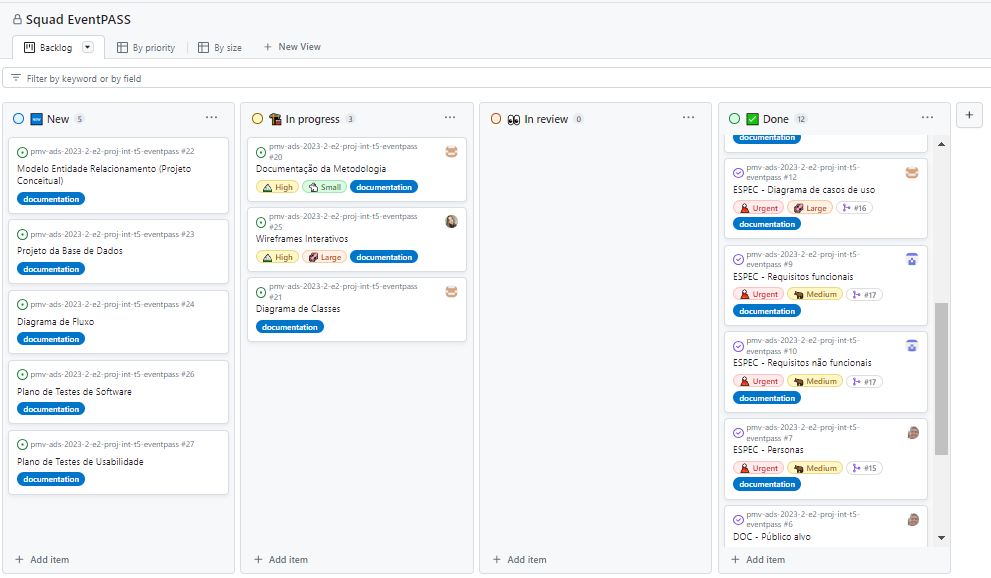

# Metodologia

Pré-requisitos: <a href="2-Especificação do Projeto.md"> Documentação de Especificação</a>

A metodologia ágil foi adotada pelo grupo, com foco na priorização do backlog, sprints de três semanas, reuniões diárias e entregas ao final de cada sprint. Iremos envolver os stakeholders na priorização do backlog e garantir que os itens selecionados possam ser concluídos em uma sprint. Serão revisadas as sprints para promover melhorias contínuas. A colaboração e comunicação eficaz são essenciais para o sucesso do projeto.

## Controle de Versão

A ferramenta de controle de versão adotada no projeto foi o [Git](https://git-scm.com/), sendo que o [Github](https://github.com) foi utilizado para hospedagem do repositório.

O projeto segue a seguinte convenção para o nome de branches:

- `main`: versão estável já testada do software
- `branch\nome do back log`: versão de desenvolvimento do software, instável

Quanto à gerência de issues, o projeto adota a seguinte convenção para etiquetas:

- `DOC`: melhorias ou acréscimos à documentação
- `ESPEC`: melhorias ou acréscimos de requisitos na documentação de projeto

## Gerenciamento de Projeto

### Divisão de Papéis

A equipe responsável pelo desenvolvimento do EventPASS utiliza metodologias ágeis escolhendo o Scrum como base para a gestão do projeto

**Definição da equipe**

- Scrum Master: Sandro Shayne Dutra
- Product Owner: Júlia Chaves Dutra
- Equipe de Desenvolvimento
  - Julia Chaves Dutra
  - Luiz Eduardo Possidonio
  - Pedro Celso Mendes
  - Sandro Shayne Dutra
  - Thiago Singulano Machado
- Equipe de Design: Júlia Chaves Dutra

### Processo

Para a organização e distribuição das tarefas a equipe está utilizando o quadro Kanban disponível no Github:

- New: Recebe as atividades a serem abordadas e representa o Product Backlog. Todas as tarefas identificadas ao longo do projeto também devem ser incluídas nesta lista.

- In progress: é uma lista das tarefas que já estão em andamento

- In review: Nesta fase, as modificações já foram implementadas no projeto, porém ainda estão em período de testes, podendo ainda passar por algumas alterações.

- Done: Aqui estão listadas as tarefas que passaram pelos testes e controle de qualidade, e estão prontas para serem entregues ao usuário. Não são necessárias mais edições ou revisões, elas estão agendadas e prontas para serem implementadas.

### Ferramentas

As ferramentas empregadas no projeto são:

- Visual Studio Code.
- Microsoft Teams
- Github
- Astah UML
- Figma

O editor de código Visual Studio foi escolhido pois possui integração com a ferramenta de versionamento de código GitHub utilizada pela equipe como repositório do código e documentação.

Para a criação dos artefatos de software, priorizamos o uso de ferramentas alternativas e gratuitas de tecnologia, como o Astah para a elaboração dos diagramas UML e o Figma para a criação dos wireframes.

Para a comunicação da equipe, foi definida a ferramenta Microsoft Teams pois possibilita reuniões por videoconferência e comunicação eficiente via chat, mantendo um histórico de todas as conversas, facilitando a referência e o acompanhamento do progresso das discussões.
