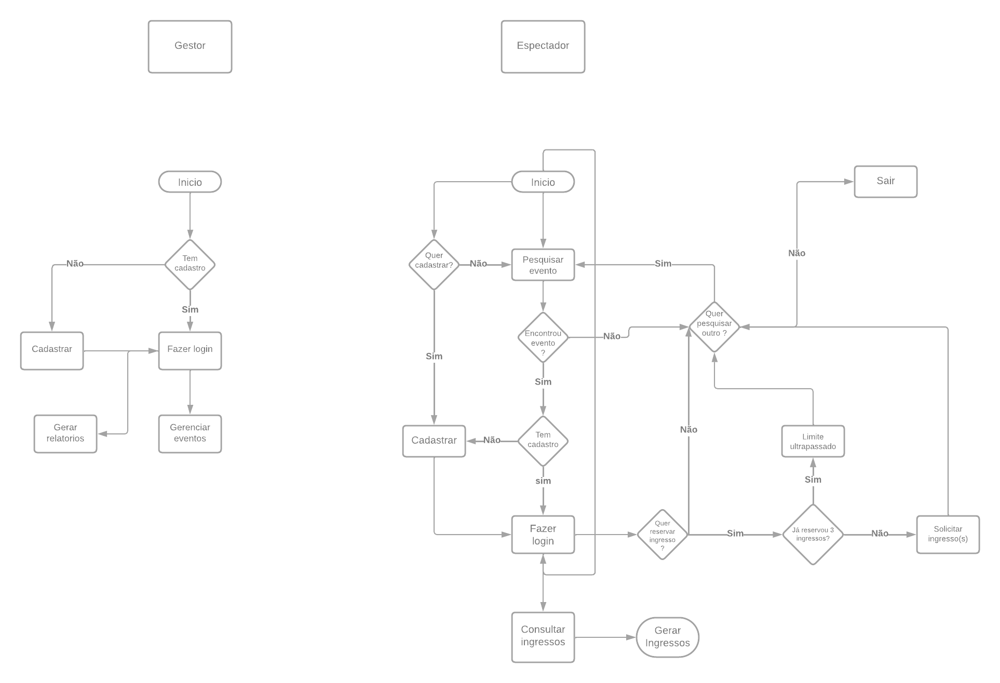

# Projeto de Interface

A concepção da interface do sistema foi elaborada para melhorar a experiência do usuário, enfatizando acessibilidade, facilidade de uso e eficiência como pilares fundamentais.

## Diagrama de Fluxo

O diagrama representa a análise do fluxo de interação entre o usuário e o sistema. Isso possibilita uma cuidadosa planificação das interações e dos caminhos das telas, que resultarão em um impacto positivo na qualidade do wireframe interativo que está sendo desenvolvido.

## Wireframes

São protótipos usados em design de interface para sugerir a estrutura de um site web e seu relacionamentos entre suas páginas. Um wireframe web é uma ilustração semelhante do layout de elementos fundamentais na interface.

> **Links Úteis**:
>
> - [Protótipos vs Wireframes](https://www.nngroup.com/videos/prototypes-vs-wireframes-ux-projects/)
> - [Ferramentas de Wireframes](https://rockcontent.com/blog/wireframes/)
> - [MarvelApp](https://marvelapp.com/developers/documentation/tutorials/)
> - [Figma](https://www.figma.com/)
> - [Adobe XD](https://www.adobe.com/br/products/xd.html#scroll)
> - [Axure](https://www.axure.com/edu) (Licença Educacional)
> - [InvisionApp](https://www.invisionapp.com/) (Licença Educacional)
