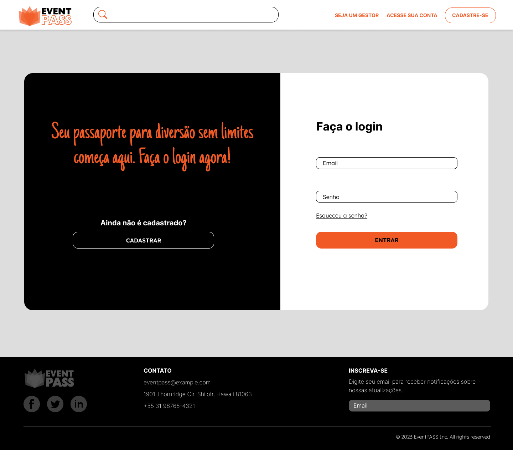
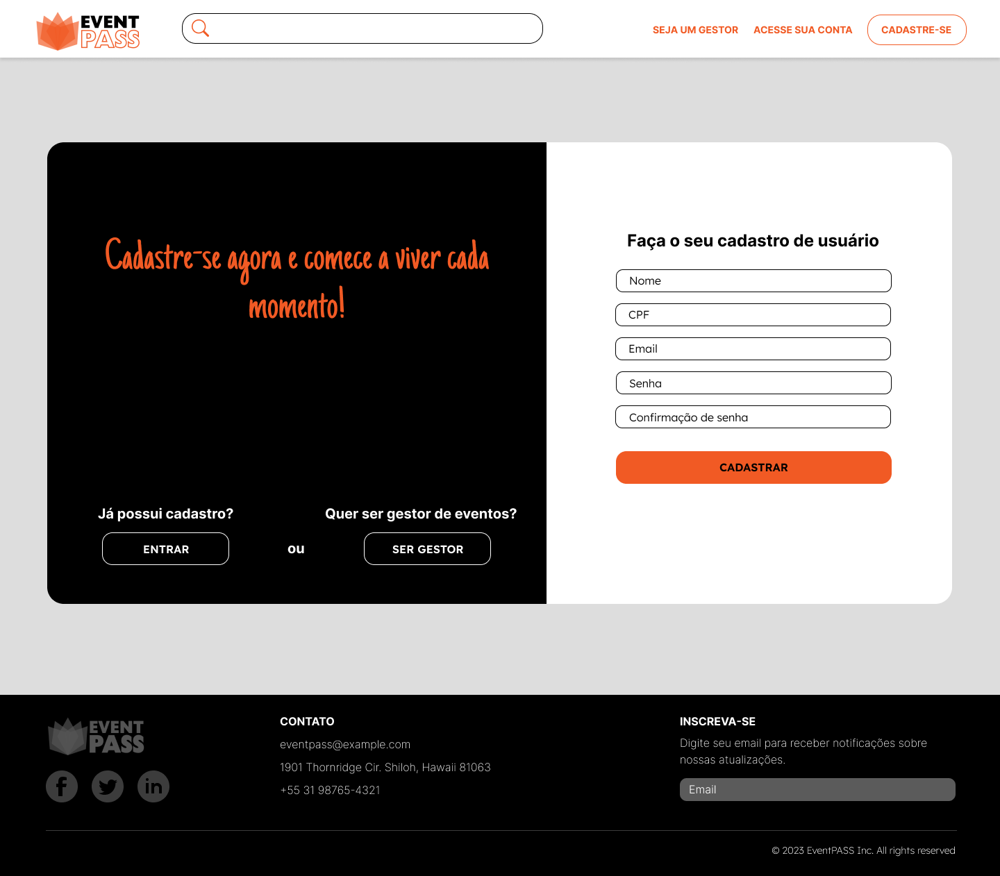

# Projeto de Interface

A concepção da interface do sistema foi elaborada para melhorar a experiência do usuário, enfatizando acessibilidade, facilidade de uso e eficiência como pilares fundamentais.

## Diagrama de Fluxo

O diagrama representa a análise do fluxo de interação entre o usuário e o sistema. Isso possibilita uma cuidadosa planificação das interações e dos caminhos das telas, que resultarão em um impacto positivo na qualidade do wireframe interativo que está sendo desenvolvido.

## Wireframes

O texto apresentado descreve a estrutura comum das telas do sistema, conforme previamente apresentado no fluxo de telas. Essas telas são compostas por três grandes blocos distintos, que são o cabeçalho, o conteúdo e o rodapé.

- O cabeçalho é a parte superior da página que geralmente contém o logo da empresa ou aplicação, bem como a navegação principal. Essa navegação pode incluir links para outras seções do site, área de login e cadastro, busca, entre outros. O cabeçalho é uma parte importante da página, pois permite que o usuário acesse facilmente outras áreas do site e saiba onde está navegando.

- O conteúdo é a área central da página e é onde são apresentados os principais elementos da tela, como formulários, tabelas, gráficos, imagens, texto, entre outros. Essa área é a principal parte da página e é onde a maior parte da interação do usuário com o sistema ocorre. É importante que o conteúdo seja apresentado de maneira clara e organizada para que o usuário possa facilmente compreender as informações apresentadas.

- O rodapé é a barra na parte inferior da página que contém informações adicionais sobre a empresa ou site, além de links úteis, como políticas de privacidade, termos de uso, contato, redes sociais, entre outros. O rodapé é uma área importante da página que geralmente contém informações legais ou outras informações que não precisam estar no corpo principal da página.

Portanto, a estrutura comum das telas do sistema é composta por esses três blocos distintos, que trabalham juntos para criar uma experiência do usuário eficiente e satisfatória. A compreensão desses blocos é essencial para o desenvolvimento de interfaces de usuário bem-sucedidas.

### Tela - Página Inicial

A página inicial apresenta uma seleção cuidadosamente escolhida de eventos em destaque, proporcionando aos usuários uma visão imediata das experiências culturais disponíveis. Um banner em destaque destaca o evento principal, capturando a atenção dos visitantes e oferecendo uma prévia do destaque da programação.

### Tela - Página de pesquisa de eventos

Nesta tela, os usuários têm a capacidade de explorar uma ampla gama de eventos, todos relacionados à sua pesquisa. A funcionalidade de filtro por categoria e data oferece uma experiência personalizada, permitindo que os usuários encontrem facilmente eventos alinhados aos seus interesses e disponibilidade de tempo.

### Tela - Página do evento / seleção dos ingressos

Esta tela proporciona uma visão detalhada do evento escolhido, apresentando informações cruciais como nome, data, localização e uma descrição envolvente. Os usuários também encontrarão uma seção dedicada à seleção de ingressos, onde podem escolher a opção que melhor se adequa às suas preferências. Um resumo claro e conciso dos ingressos selecionados está disponível, garantindo que os participantes tenham uma compreensão instantânea das escolhas feitas.

### Tela - Login

Esta tela é o ponto de entrada para os usuários acessarem a plataforma. Ela apresenta uma seção com campos dedicados para inserção de informações de login, incluindo email e senha. Além disso, há uma seção adicional com um botão de cadastro visível para aqueles que ainda não possuem uma conta.

### Tela - Cadastro de usuário

Nesta tela, os usuários têm a oportunidade de criar uma nova conta na plataforma. A seção de cadastro inclui campos para inserção de informações essenciais, como nome, CPF, email e senha. Além disso, há uma seção adicional com botões para duas opções:

- Login: Para aqueles que já possuem uma conta e desejam acessar a plataforma imediatamente.

- Cadastro de Gestor: Para indivíduos interessados em se tornar gestores de eventos, oferecendo uma oportunidade de expansão das funcionalidades e responsabilidades na plataforma.

### Tela - Cadastro de gestores

Nesta tela, os usuários interessados em se tornar gestores de eventos têm a oportunidade de criar uma conta específica para essa função. A seção de cadastro inclui campos para inserção de informações essenciais, como nome, CNPJ, email e senha. Além disso, há uma seção adicional com um botão para aqueles que já possuem uma conta e desejam acessar a plataforma imediatamente.

### Tela - Perfil de usuário

Esta tela proporciona aos usuários uma visão personalizada e interativa de seu perfil na plataforma. Ela apresenta um menu lateral com três opções:

- Home: Redireciona o usuário de volta para a página inicial da plataforma.
- Meu Perfil: Oferece a capacidade de adicionar uma foto e editar informações cadastrais. Também inclui uma seção onde o usuário pode visualizar todos os ingressos adquiridos.
- Sair: Permite ao usuário fazer logout da plataforma.

### Tela - Perfil de gestor

Nesta tela, os gestores de eventos têm acesso a um menu lateral que oferece quatro opções:

- Home: Redireciona o gestor de volta para a página inicial da plataforma.
- Meu Perfil: Permite ao gestor adicionar uma foto e editar as informações cadastrais. Também inclui uma seção onde o gestor pode visualizar todos os eventos cadastrados.
- Cadastrar Eventos: Redireciona o gestor para a página de cadastro de eventos, proporcionando uma forma fácil e direta de adicionar novos eventos à plataforma.
- Sair: Permite ao gestor fazer logout da plataforma.

### Tela - Cadastro de eventos

Nesta tela, os gestores têm a capacidade de cadastrar novos eventos na plataforma. A seção de cadastro inclui os seguintes campos:

- Nome do Evento;

- Data e Hora;

- Quantidade de Ingressos;

- Imagem;

- Descrição;

- Endereço;

