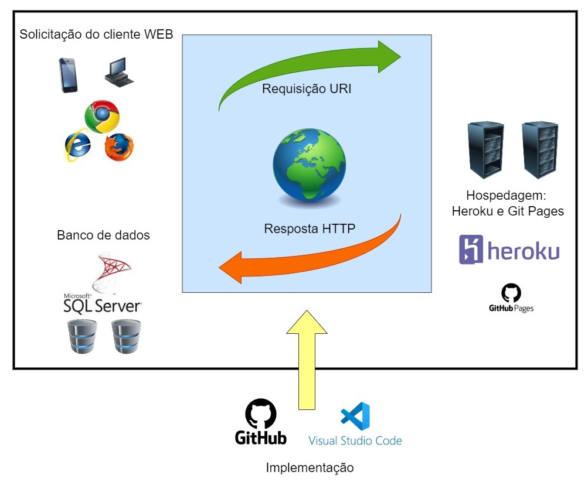

# Arquitetura da Solução

Pré-requisitos: <a href="3-Projeto de Interface.md"> Projeto de Interface</a>

Definição de como o software é estruturado em termos dos componentes que fazem parte da solução e do ambiente de hospedagem da aplicação.

## Diagrama de Classes

O diagrama de classes é uma ferramenta de modelagem em UML que descreve as classes do sistema, seus atributos e métodos, bem como os relacionamentos entre elas, essa visualização facilita a compreensão e comunicação entre os membros da equipe de desenvolvimento, sendo essencial no processo de design e implementação de software

## Modelo ER (Projeto Conceitual)

O diagrama relacional ER (Entidade-Relacionamento) é uma ferramenta de modelagem utilizada para representar visualmente as entidades, seus atributos e os relacionamentos entre elas. Abaixo está o diagrama modelado pela equipe de desenvolvimento:

## Projeto da Base de Dados

Com base no diagrama de relacionamento ER realizado pela equipe, foi desenvolvido o seguinte projeto de base de dados para ilustrar as tabelas, seus atributos e as conexões entre elas, ajudando a compreender a organização dos dados em um banco de dados, facilitando o desenvolvimento e a manutenção do software desenvolvido.

## Tecnologias Utilizadas

Para implementar a solução, foi concebida uma estrutura de aplicações que abrange tanto o front-end quanto o back-end. No front-end, serão empregadas as linguagens HTML, CSS e JavaScript, junto com a biblioteca REACT.TS. Para o desenvolvimento do back-end, serão utilizadas as linguagens C# em conjunto com o Framework da API Web do ASP.NET Core. O sistema de gerenciamento de dados (SGBD) escolhido será o SQL Server. Durante a fase de implementação e desenvolvimento, faremos uso da ferramenta Visual Studio Code para a criação de códigos, e o GitHub será a plataforma escolhida para hospedar o código-fonte.

## Hospedagem

Para a hospedagem da aplicação, foi definido junto ao time de desenvolvimento a utilização da plataforma HEROKU, pois possui integração nativa com sistemas de controle de versão baseados em Git e oferece um processo de implantação simples e rápido.
