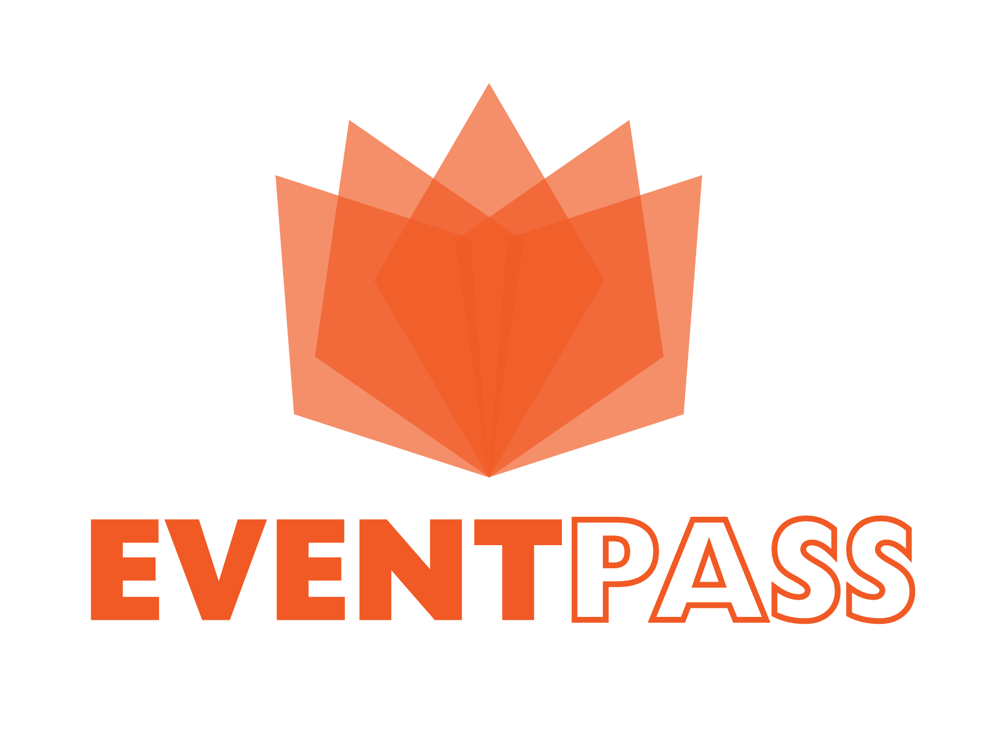
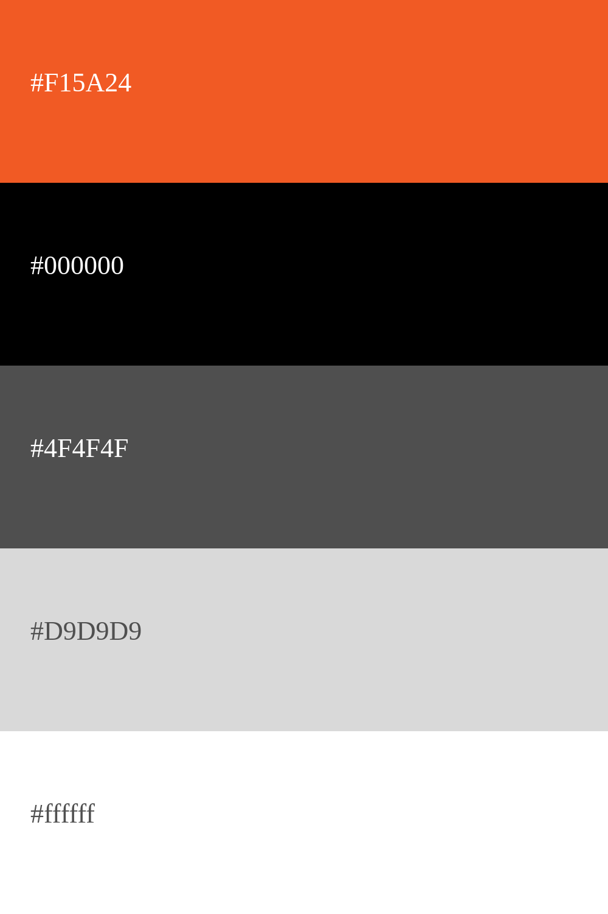
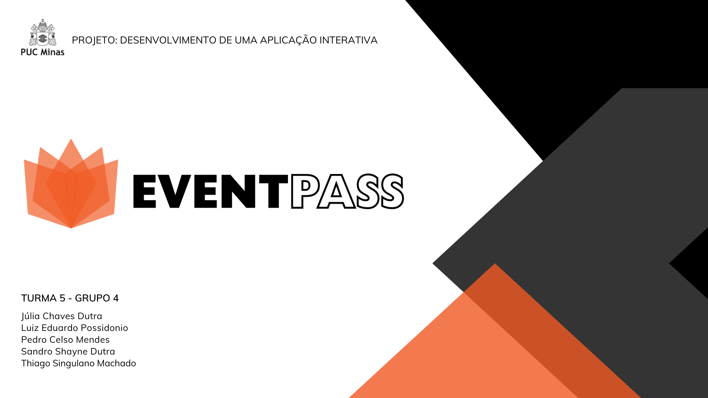
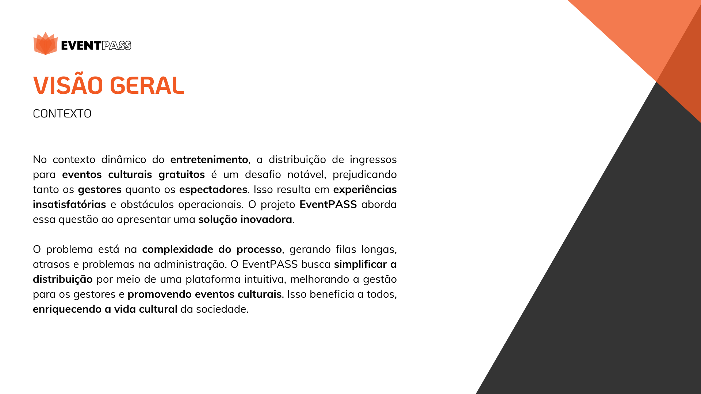
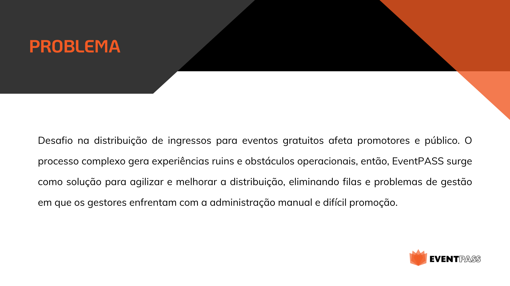
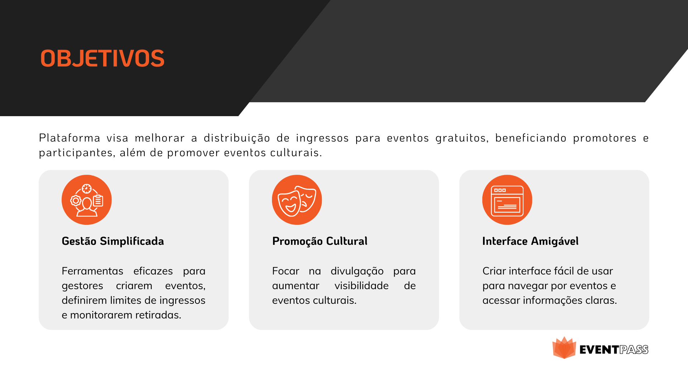
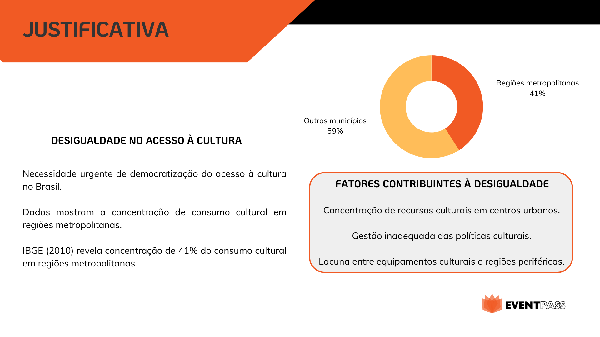
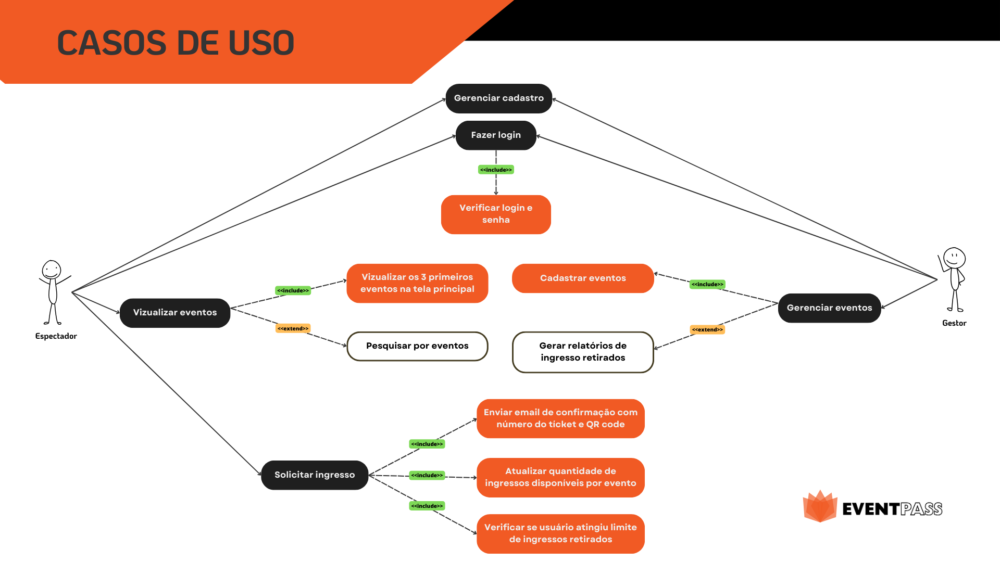

# Apresentação

Pré-requisitos: Todos os demais artefatos

Conjunto de slides em um arquivo PowerPoint ou PDF com a apresentação do projeto contemplando todos os itens trabalhados nos demais artefatos.

## Título do Projeto

EventPass

## Identidade Visual (Marca, Design)

 

## Paleta de cores

## Conjunto de Slides (Estrutura)

 
 
 
 
 
 

